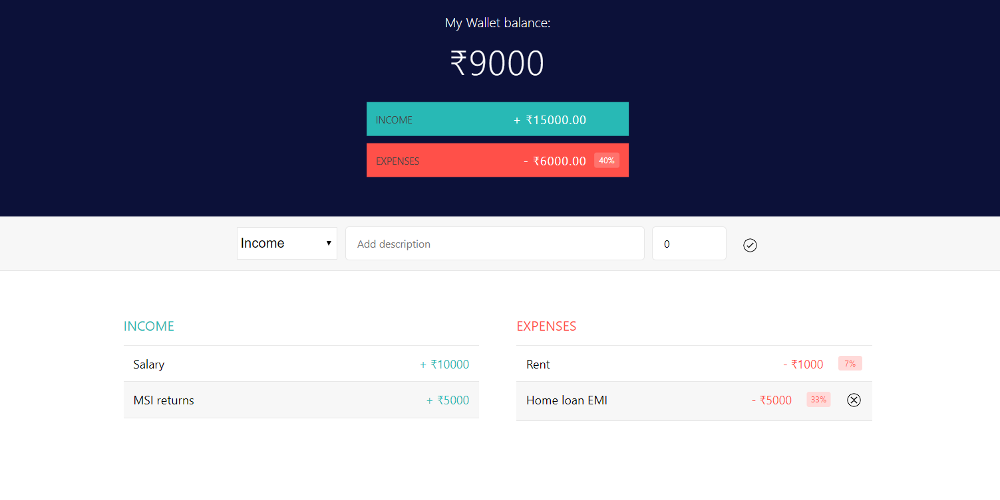

# My Wallet

My Wallet is a simple application uses hooks,contextAPI and reducer features of the react.

## build and start
execute install
```
> yarn install
```
start the application
```
> yarn start
```

Runs the app in the development mode.<br />
Open [http://localhost:3000](http://localhost:3000) to view it in the browser.

The page will reload if you make edits.<br />
You will also see any lint errors in the console.

Here's an app screen shot:



Move along.

Credit sources:
 1. taken the screen style and html from the codepen and converted to react project.
    https://codepen.io/DomoBritton/pen/QdKjqj
